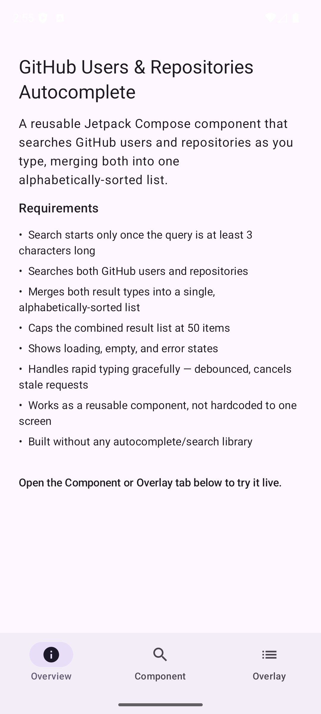
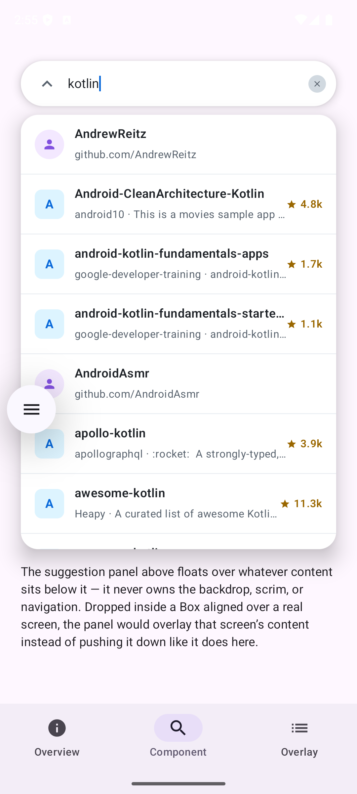
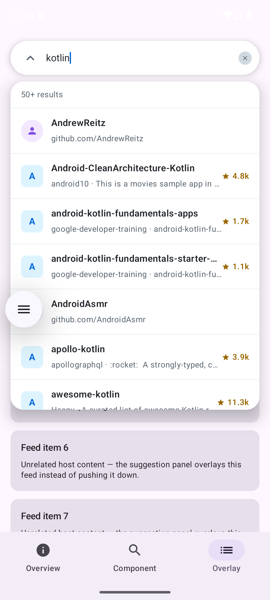

# GitHub Users & Repositories Autocomplete

A reusable Jetpack Compose component that searches GitHub users and
repositories as you type, merges both result types into one
alphabetically-sorted list, and floats over whatever screen hosts it —
built from scratch, no autocomplete library.

The search logic itself — networking, caching, merging, and the
debounce/min-length policy — lives in a Kotlin Multiplatform `:shared`
module, so the same domain and data layers also back a small native
SwiftUI iOS app (see [iOS app](#ios-app) below).

## Demo

| Overview | Component | Overlay |
|---|---|---|
|  |  |  |

The demo app is three tabs: **Overview** describes the assignment and
its requirements, **Component** hosts the bar with the panel pushing
the rest of the screen down, and **Overlay** hosts the exact same bar
floating over an unrelated scrolling feed instead — the same component
in both of its layout modes, side by side. Tapping a result in either
tab opens a full-screen detail page for that repository or user, with
Open on GitHub, Share and Copy link actions.

## Quick usage

Drop `GitHubAutocompleteBarComponent` onto any screen inside a `Box` —
it owns only the bar and the suggestion panel below it, never the
backdrop, scrim, or navigation. This is a take-home assignment, so the
component lives directly in the app module; in a real project it
would ship as its own Gradle module, or a published library (AAR via
Maven/JitPack) if it needed to be shared across separate apps or
repos:

```kotlin
Box(Modifier.fillMaxSize()) {
    HostScreenContent()
    GitHubAutocompleteBarComponent(
        modifier = Modifier
            .align(Alignment.TopCenter)
            .padding(16.dp)
            .fillMaxWidth(),
        onItemClick = { item -> navigateToDetail(item) },
    )
}
```

That's it — debouncing, networking, caching, and state rendering are
all handled internally: the component's `AutocompleteViewModel` is
resolved through Hilt, and everything below it comes from `:shared`
via the Koin→Hilt bridge (see Architecture). See `DemoScreen.kt` for
the three-tab example above: Component and Overlay both drop in this
same composable, each with its own `AutocompleteViewModel` instance so
typing in one tab never leaks into the other.

## Requirements checklist

| Requirement | Where it lives |
|---|---|
| Minimum 3 characters before searching | `SearchAutocompleteUseCase`'s `MIN_QUERY_LENGTH` gate, applied to the trimmed query |
| Fetches both users and repositories | `GitHubSearchNetworkSourceImpl`, launched in parallel via `async` |
| Combined, alphabetically-sorted list | `ResultMerger.mergeAndSort`, keyed on repository name / login |
| Capped at 50 results | `SearchLimits.MAX_RESULTS` — single source of truth for both the per-type fetch limit and the final cap (the panel's "50+ results" header mirrors it as `DEFAULT_MAX_RESULTS` in `:app`) |
| Loading / empty / error states | `AutocompleteUiState`, rendered by `SuggestionPanel` |
| Rapid-input handling | `debounce` + `distinctUntilChanged` + `flatMapLatest` in the use case |
| Reusable, not hardcoded to one screen | `GitHubAutocompleteBarComponent` — plain composable API, demoed over three different screens |
| No autocomplete library | Search bar, dropdown, and every state are hand-built Compose |

## Technologies used

- **Kotlin** 2.3.21 / **Kotlin Multiplatform** — `:shared` targets
  Android, `iosArm64`, and `iosSimulatorArm64`
- **Android** — SDK 37 (`minSdk` 26), AGP 9.3.2
- **Jetpack Compose** (BOM `2026.08.00`) + Material3 — the entire
  Android UI, no XML layouts
- **SwiftUI** — the iOS app, consuming `:shared` as an Xcode framework
- **Hilt** 2.60.1 (via KSP) — DI for Android-only classes, including a
  per-tab-keyed `hiltViewModel()` in the demo
- **Koin** 4.2.2 — DI for `:shared`, bridged into Hilt on Android and
  bootstrapped directly from Swift on iOS
- **Ktor** 3.5.2 + **kotlinx.serialization** 1.11.0 — multiplatform
  networking and JSON parsing, with a per-platform engine (OkHttp on
  Android, Darwin/`NSURLSession` on iOS)
- **SQLDelight** 2.3.2 — multiplatform local cache for search results
- **Kotlin Coroutines** 1.11.0 — `debounce`/`flatMapLatest` in the use
  case, parallel user/repo fetch via `async` in the network source
- **Testing** — `kotlin.test` + Ktor's `MockEngine` +
  [Turbine](https://github.com/cashapp/turbine) for `:shared`'s
  multiplatform tests; JUnit4 + [MockK](https://mockk.io) for `:app`'s
  unit tests; Espresso + Compose UI Test for instrumented tests;
  [Paparazzi](https://github.com/cashapp/paparazzi) for JVM
  screenshot tests (see Testing below)
- **ktlint** — code style for both `:app` and `:shared`, enforced in CI

## Architecture

Clean Architecture + MVVM, split across three Gradle modules. `:app` holds
Android/Compose-only code and the app's navigation graph; `:feature:detail`
is the result detail screen as a standalone feature module; `:shared` holds
the multiplatform domain and data layers, compiled for both Android and iOS.
Android library modules are configured by convention plugins in
`build-logic/` — see `docs/architecture/modularization.md`. Dependencies still point
inward — `:app`'s `ui/` depends on `:shared`'s `domain/` interfaces, and
`:shared`'s own `remote/`/`cache/` depend on its `domain/`, never the
other way around. `:app` reaches `:shared` through a small Koin→Hilt
bridge (`SharedKoinBridgeModule.kt`), since `:shared` is Koin-only —
Hilt's annotation processor can't run on Kotlin/Native.

```
:app (pl.gi.codingchallenge)
├── di/
│   └── SharedKoinBridgeModule.kt        # bridges Koin (:shared) into Hilt (:app)
├── ui/
│   ├── autocomplete/                    # the reusable component
│   │   ├── AutocompleteViewModel.kt     # maps SearchOutcome -> AutocompleteUiState
│   │   ├── AutocompleteUiState.kt       # Idle/Loading/Success/Empty/Error
│   │   ├── GitHubAutocompleteBar.kt     # public entry point (Hilt-backed + stateless overload)
│   │   ├── FloatingSearchBar.kt         # the pill bar itself
│   │   ├── SuggestionPanel.kt           # the floating results card
│   │   ├── SearchResultRow.kt           # item renderer
│   │   └── testing/AutocompleteTestTags.kt
│   ├── AppNavHost.kt                    # the only NavHost: demo -> detail
│   └── DemoScreen.kt                    # 3-tab demo host — see Demo above
├── util/
│   └── ResourceUtil.kt                  # dimRes/strRes/colRes/spRes helpers
├── CodingChallengeApp.kt                # @HiltAndroidApp, starts Koin before Hilt resolves anything
└── MainActivity.kt

:feature:detail (pl.gi.codingchallenge.feature.detail)
├── DetailNavigation.kt                  # public API: navigateToDetail() + detailScreen()
├── DetailRoute.kt                       # internal type-safe route, item carried as JSON
├── ResultDetailRoute.kt                 # wires buttons to browser/share sheet/clipboard
├── ResultDetailScreen.kt                # stateless repo/user detail UI
├── GitHubUrl.kt, GitHubLinkActions.kt   # URL building + intents
└── testing/DetailTestTags.kt

build-logic/convention                   # codingchallenge.android.library / .compose / .paparazzi

:shared (pl.gi.codingchallenge.shared) — commonMain, compiles for Android + iOS
├── di/
│   └── SharedModule.kt                  # Koin module (+ per-target AndroidPlatformModule/IosPlatformModule)
├── domain/
│   ├── model/
│   │   ├── SearchResultItem.kt          # sealed interface: UserResult / RepoResult
│   │   ├── SearchOutcome.kt             # sealed interface: the use case's output
│   │   ├── QueryRequest.kt              # query text + retry counter
│   │   └── SearchLimits.kt              # MAX_RESULTS
│   ├── usecase/
│   │   └── SearchAutocompleteUseCase.kt # debounce, min-length gate, cancel-on-new-input
│   ├── repository/
│   │   ├── GitHubSearchRepository.kt        # the interface the use case (and iOS) depend on
│   │   ├── GitHubSearchNetworkSource.kt     # narrower interface: raw network access
│   │   ├── GitHubSearchCache.kt             # narrower interface: storage only
│   │   └── CachingGitHubSearchRepository.kt # network-first, cache-as-fallback-on-failure
│   └── ResultMerger.kt                  # merges + sorts + caps both result types
├── remote/
│   ├── GitHubApi.kt                     # Ktor client - the only thing that knows GitHub's REST shape
│   ├── GitHubApiException.kt            # typed errors: RateLimited/Unauthorized/NotFound/...
│   ├── GitHubSearchNetworkSourceImpl.kt # implements GitHubSearchNetworkSource via GitHubApi
│   ├── ResultMappers.kt                 # DTO -> domain
│   └── dto/                             # UserDto, RepositoryDto, GitHubSearchResponse<T>
├── cache/
│   └── SearchResultCache.kt             # implements GitHubSearchCache via SQLDelight
└── Platform.kt                          # expect/actual demo (+ Platform.android.kt/Platform.ios.kt)
```

The tree above is `commonMain` — the code that compiles for both platforms. `androidMain`/
`iosMain` hold the small per-target pieces it needs (SQL driver, HTTP engine, Koin bootstrap) —
see `docs/kmp-knowledge-base.md` §1 for the full source-set breakdown.

- `SearchAutocompleteUseCase` returns a domain-only `SearchOutcome`
  (`QueryTooShort` / `Loading` / `Success` / `Failure`) — deliberately
  no `Empty` variant, since an empty result set is just
  `Success(emptyList())`; deciding to render that as an "empty state"
  is a UI concern, left to `AutocompleteViewModel`.
- `CachingGitHubSearchRepository` is the only class that implements
  `GitHubSearchRepository` — `:app`'s Hilt graph never sees a concrete
  network or cache class directly, only this decorator, resolved
  through the Koin bridge. See
  `docs/architecture/github-search-caching-decision.md` for why it's
  split into `GitHubSearchNetworkSource`/`GitHubSearchCache` instead of
  one interface.
- `GitHubApi` checks the HTTP status before decoding, mapping non-2xx
  responses to typed `GitHubApiException`s (rate limited, unauthorized,
  server error, ...) instead of letting them surface as JSON parse
  failures. See `docs/architecture/github-api-error-handling.md`.

## iOS app

`iosApp/` is a minimal SwiftUI client: a single search screen with the
same idle/loading/success/empty/error states (including retry), backed
by the exact same `:shared` repository, network source, and SQLDelight
cache as the Android app. Koin is started from Swift
(`KoinBootstrapKt.doInitKoin()`), and the repository is fetched through
a small Koin helper in `iosMain`.

The Xcode project uses Direct Integration: a Run Script build phase
calls `./gradlew :shared:embedAndSignAppleFrameworkForXcode`, which
builds `:shared` as the `Shared` framework and embeds it — no
CocoaPods or SPM.

One deliberate difference from Android: `ContentView.swift` doesn't
drive `SearchAutocompleteUseCase`'s Flow pipeline, since Kotlin/Native
doesn't export `Flow` to Swift in a usable form. It calls the shared
repository's `suspend fun search` (exported as `async`) directly and
re-implements the debounce, trimming, and min-length policy natively
in Swift. See `docs/kmp-knowledge-base.md` §8–9 for the interop
details.

## Testing

68 JVM/multiplatform tests + 31 instrumented tests across 22 files.
Most of the logic is tested once in `:shared`'s `commonTest`, which
runs on both the Android host JVM and the iOS simulator:

- **`SearchAutocompleteUseCaseTest`** (9) — debounce, cancellation,
  the min-length gate, query trimming, and retry, all driven by a
  virtual-time test dispatcher, no real delays.
- **`GitHubApiTest`** (9) — the Ktor client against `MockEngine`:
  request shape, and every non-2xx status mapping to the right
  `GitHubApiException`.
- **`CachingGitHubSearchRepositoryTest`** (5) — network-first,
  cache-as-fallback, and that cancellation is propagated rather than
  swallowed into a cache fallback.
- **`SearchResultCacheTest`** (4, `androidHostTest`) — the real
  SQLDelight cache against an in-memory JDBC SQLite driver, including
  eviction of the oldest queries beyond the cap.
- **`GitHubSerializationTest`** (2) — decodes real (trimmed) GitHub
  JSON payloads through the actual `kotlinx.serialization` pipeline,
  not just hand-built DTOs, so a wrong `@SerialName` would actually
  fail a test.
- **`GitHubAutocompleteBarTest`** (22, instrumented) — every UI state,
  focus handling, back-press, scroll-reset on a new query, the
  result-count header, and the divider/leading-icon edge cases, via
  real Compose UI interactions.
- **`GitHubAutocompleteBarScreenshotTest`** (7) — [Paparazzi](https://github.com/cashapp/paparazzi)
  golden-image tests, one per UI state plus the singular and capped
  ("50+") result-count header. Unlike the assertion-based
  tests above, which only check semantics (does this tag exist, does
  this text say X), each of these renders the composable to a bitmap
  and diffs it pixel-for-pixel against a checked-in reference image
  (the "golden"). That's what catches a purely visual regression —
  wrong spacing, a clipped row, a color that quietly changed — that
  would pass every semantic assertion untouched. Paparazzi renders on
  the JVM via a bundled Android SDK, so this runs in plain unit tests
  with no emulator; a failure produces a diff image showing exactly
  what changed. `./gradlew :app:recordPaparazziDebug` (re)generates
  the goldens after an intentional UI change;
  `:app:verifyPaparazziDebug` (part of `check`) is what actually fails
  the build on a mismatch.
- Plus `GitHubSearchNetworkSourceImplTest`, `ResultMergerTest`,
  `ResultMappersTest`, `SearchResultItemTest`,
  `AutocompleteViewModelTest`, `ResultCountTest`,
  `FormatResultCountTest` (real plural strings via Paparazzi's
  `Resources`, no device), and `ResourceUtilTest` (instrumented)
  covering the remaining domain/data/presentation logic.
- **`:feature:detail`** — `ResultDetailScreenScreenshotTest` (3
  goldens: repo, repo without description, user;
  `:feature:detail:recordPaparazziDebug` re-records them),
  `DetailRouteTest` (route JSON round-trip), `GitHubUrlTest`,
  `FormatStarsCountTest`, plus instrumented `ResultDetailScreenTest`
  (content + every button's callback) and `DetailNavigationTest`
  (navigate in, back out, via a throwaway `NavHost`).
- **`DetailFlowTest`** (3, instrumented) — end-to-end through the real
  `MainActivity` and nav graph: search, open a repo or user detail,
  come back via system or toolbar back, with the tab and query intact.
  `HiltTestRunner` + `FakeSearchModule` (`@TestInstallIn`, replacing
  the Koin bridge) keep it offline and deterministic.

Run everything: `./gradlew check` (unit tests + lint + ktlint + Paparazzi)
and `./gradlew connectedDebugAndroidTest` (needs a device/emulator).
`./gradlew :shared:iosSimulatorArm64Test` runs `:shared`'s tests on the
iOS simulator (macOS only). `./gradlew ktlintFormat` auto-fixes most
style violations locally before pushing.

CI runs two workflows:

- **Android CI** (`.github/workflows/android-ci.yml`) — `ktlintCheck`,
  then `./gradlew check`, on every push and pull request to `main` and
  `develop`.
- **iOS CI** (`.github/workflows/ios-ci.yml`) — on pull requests that
  touch `:shared`'s common/iOS sources or the build configuration, runs
  `./gradlew :shared:iosSimulatorArm64Test` on a macOS runner. It
  covers `:shared` only, not the Xcode app build: GitHub's hosted
  runners currently ship an older Xcode than `iosApp` requires.

## Running it

**Android**

1. Clone the repo and open it in Android Studio.
2. Sync Gradle, then run the `app` configuration on a device or
   emulator.
3. `./gradlew check` runs the full non-instrumented test suite.

**iOS** (macOS only)

1. Open `iosApp/iosApp.xcodeproj` in Xcode 27 or newer (the project's
   deployment target is iOS 27.0).
2. Select an iOS simulator and run the `iosApp` scheme — the build
   phase compiles and embeds `:shared` via Gradle automatically, so the
   first build takes a while.

No API token is required — this uses GitHub's public, unauthenticated
search endpoints.

## Known limitations

- GitHub's unauthenticated search API is capped at 10 requests/minute
  per IP. Hitting it now produces a specific "rate limit exceeded — try
  again shortly" message, but it's still shown in the same generic
  error state as any other failure, with no dedicated UI or automatic
  back-off.
- A local cache now sits in front of search results (SQLDelight),
  but it's network-first with cache-as-fallback-on-failure, not a
  general offline mode — a query that's never been searched before
  still fails with no network, and a cached result can still be
  stale if GitHub's data changed since it was cached. The cache keeps
  only the 50 most recently stored queries, evicting the oldest. Room's
  newer Kotlin Multiplatform support was considered as an alternative
  to SQLDelight and may be worth a second look later — it can read
  better to teams already standardized on Android's Jetpack/Room
  stack.
- The combined list is alphabetically sorted, but only within the
  candidates GitHub returns. Each type is fetched as GitHub's own
  relevance-ranked top 50, so for a query with more than 50 matches of
  one type, an alphabetically-earlier match that GitHub ranks lower
  never makes it into the list.
- The result-count header shows "50+ results" whenever the list hits
  the 50 cap, even if GitHub had exactly 50 matches; the true total
  (`total_count`) isn't threaded through from `:shared`.
- The iOS app re-implements the debounce/min-length policy in Swift
  rather than sharing it (see [iOS app](#ios-app)), so the two
  platforms' copies of that policy have to be kept in sync by hand.
  The iOS UI is also deliberately minimal — no overlay mode or
  reusable component, and no UI tests.

## Further documentation

- `docs/kmp-knowledge-base.md` — how the KMP setup works and why:
  source sets, Koin/Hilt coexistence, Ktor, SQLDelight, testing across
  targets, iOS interop, CI, and a gotcha table.
- `docs/architecture/` — decision records: search caching design,
  GitHub API error handling, static analysis tooling, diagramming
  tools.
- `docs/backlog.md` — known bugs and considerations, open and
  resolved.
- `docs/ai/` — the Claude Code harness: concepts
  (`claude-code-harness.md`), the setup and per-feature runbook
  (`getting-started.md`), and the result-count header built as its
  first test feature (`harness-test-feature.md`).

## Development notes

This project was built with the help of AI coding assistants —
primarily [Claude Code](https://claude.com/claude-code), with
[OpenCode](https://opencode.ai) also used for part of the work —
alongside manual review, on-device testing, and the architectural
decisions described above. The Claude Code setup is committed in
`.claude/`: permission rules, hooks (ktlint on edit, a compile check
before finishing, blocks on Co-Authored-By trailers and remote branch
deletion), the `new-feature` and `run-android` skills, and a
`compose-reviewer` subagent — see `docs/ai/getting-started.md`.

## License

MIT
