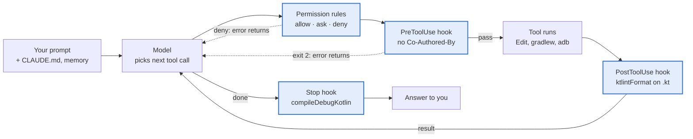

# Claude Code Harness for Android Projects

**Status:** in progress — permissions, the ktlint PostToolUse hook, the Co-Authored-By
PreToolUse hook and the compile-check Stop hook are installed in `.claude/settings.json`, the
`run-android` skill is in `.claude/skills/` and the `compose-reviewer` subagent is in
`.claude/agents/`; the remaining steps below are not yet.
The hands-on runbook is [getting-started.md](getting-started.md). Live, commentable copy:
[Claude Doc](https://claude.ai/code/artifact/0277d320-e04d-4fb0-884e-e45a049c49dd).

## Implementation steps

Build it one layer at a time, cheapest and highest-value first, and test each layer before adding
the next. Details for each step are under [Example setup](#example-setup-for-codingchallenge) below.

- [x] Permissions: add the allow/deny lists to `.claude/settings.json`; try running a denied command and watch it get blocked
- [x] One PostToolUse hook: ktlint on edit; edit a `.kt` file and confirm it was formatted
- [x] One PreToolUse hook: the Co-Authored-By blocker; learn the stdin JSON and exit-code-2 contract
- [x] Stop hook: compile check before Claude reports done
- [x] Skill: `run-android` with install, launch and screenshot
- [x] Subagent: `compose-reviewer` on a real Compose change
- [ ] MCP: a GitHub server, once PR work from the CLI feels useful
- [ ] Trim `CLAUDE.md`: remove rules now enforced by config

The same building blocks carry over to a web project: only the commands in permissions and hooks change, for example `npm test` instead of `./gradlew`.

## Test feature

After setup, validate the harness with one small feature: a result-count header in the
suggestion panel. See [harness-test-feature.md](harness-test-feature.md).

## What a harness is

The harness is everything around the model that turns text-in, text-out into a working agent. In Claude Code it has five jobs.

| Job | What it does |
| --- | --- |
| Agent loop | Sends your prompt, runs the tools the model requests (Read, Edit, Bash), returns results, repeats until done |
| Tools | File read/edit, shell, search, web, subagents, MCP servers such as Android Studio's diagnostics |
| Context assembly | Decides what the model sees each turn: system prompt, CLAUDE.md, memory, git status, tool results; compacts long sessions |
| Policy and enforcement | Permission modes, allow/deny rules, and hooks: shell commands the harness runs at fixed points |
| Extensions | Skills (packaged instructions), subagents (own context), slash commands, MCP servers |

### Soft rules vs hard rules

This is the key distinction when setting things up.

- **Soft rules** are text the model reads and tries to follow: `CLAUDE.md` and memory. "No Co-Authored-By" and "don't run connectedDebugAndroidTest" are soft today: they hold only because the model obeys.
- **Hard rules** are config the harness enforces: permission rules and hooks in `settings.json`. A denied command cannot run even if the model tries.

Rule of thumb: conventions and reasoning go in `CLAUDE.md`; anything that must never be skipped goes in `settings.json`.

## How it fits with Android Studio

Claude Code runs as a CLI, either in Android Studio's terminal or through the JetBrains plugin. Android Studio stays the editor, emulator and debugger; the harness connects to it in three ways.

- **IDE bridge (MCP):** the plugin exposes tools such as `mcp__ide__getDiagnostics`, so Claude can read the IDE's lint warnings and errors. Proposed edits can show as diffs in the IDE.
- **Gradle as ground truth:** Claude can't click Build, so it verifies through `./gradlew` (`assembleDebug`, `testDebugUnitTest`, `ktlintCheck`). These commands are what permissions and hooks target.
- **Device via adb:** install, launch and screenshot go through the shell (`adb shell screencap`), so they fall under the same permission rules.

## Example setup for CodingChallenge

A full setup adds hard rules, automation and reusable agents around `CLAUDE.md`.

```text
CodingChallenge/
├── .claude/
│   ├── CLAUDE.md                 # soft rules (exists)
│   ├── settings.json             # hard rules: permissions + hooks (checked in)
│   ├── settings.local.json       # personal overrides (gitignored)
│   ├── hooks/
│   │   ├── ktlint-on-edit.sh
│   │   └── block-coauthor.sh
│   ├── agents/
│   │   └── compose-reviewer.md   # subagent definition
│   └── skills/
│       └── run-android/SKILL.md  # how to launch this app
└── .mcp.json                     # optional extra MCP servers (e.g. GitHub)
```

### 1. Permissions

Allow frequent safe commands so they never prompt; deny what must not run unasked. This turns the instrumented-test preference into a hard rule. Anything not listed still asks.

```json
{
  "permissions": {
    "allow": [
      "Bash(./gradlew assembleDebug:*)",
      "Bash(./gradlew testDebugUnitTest:*)",
      "Bash(./gradlew :shared:allTests:*)",
      "Bash(./gradlew ktlintCheck:*)",
      "Bash(./gradlew ktlintFormat:*)",
      "Bash(git status:*)", "Bash(git diff:*)", "Bash(git log:*)"
    ],
    "deny": [
      "Bash(./gradlew connectedDebugAndroidTest:*)",
      "Bash(./gradlew connectedAndroidTest:*)",
      "Read(./local.properties)"
    ]
  }
}
```

### 2. Hooks

Hooks are automation the model cannot forget. Both live in the same `settings.json`.

```json
{
  "hooks": {
    "PostToolUse": [
      { "matcher": "Edit|Write",
        "hooks": [{ "type": "command", "command": ".claude/hooks/ktlint-on-edit.sh" }] }
    ],
    "PreToolUse": [
      { "matcher": "Bash",
        "hooks": [{ "type": "command", "command": ".claude/hooks/block-coauthor.sh" }] }
    ]
  }
}
```

The PreToolUse hook enforces the commit rule. Hook input arrives as JSON on stdin; exit code 2 blocks the call and sends stderr back to Claude.

```bash
# .claude/hooks/block-coauthor.sh
cmd=$(jq -r '.tool_input.command // empty')
if [[ "$cmd" == *"git commit"* ]] && grep -qi 'co-authored-by' <<<"$cmd"; then
  echo "Blocked: Co-Authored-By trailers are banned in this repo (see .claude/CLAUDE.md). Commit again without the trailer." >&2
  exit 2
fi
exit 0
```

`ktlint-on-edit.sh` reads `.tool_input.file_path` the same way and runs `./gradlew ktlintFormat` when a `.kt` or `.kts` file changed, so formatting always matches the `ktlintCheck` step in `android-ci.yml`. Other useful events:

- **Stop:** run `./gradlew compileDebugKotlin` when Claude finishes, so it can't report done on broken code.
- **SessionStart:** print the current backlog ticket into context.

### 3. Subagent

A subagent runs in its own context with restricted tools, so a review never clutters the main session and can't edit files.

```markdown
---
name: compose-reviewer
description: Reviews changed Jetpack Compose files for recomposition, state and modifier issues.
  Use after a Compose UI change, before committing. Pass the changed .kt file paths in the prompt.
tools: Read, Grep, Glob
model: haiku
---

You review Jetpack Compose code. You can read files but not change them.

Review only the @Composable functions in the files named in your task. Check:

1. Parameters are stable: no `MutableList`, `var` properties or other unstable types without a
   reason; lambdas and immutable/data classes are fine.
2. State: `remember` for values that survive recomposition, `derivedStateOf` for state computed
   from other state, `rememberSaveable` where it must survive rotation.
3. State hoisting: composables take state and callbacks as parameters rather than owning a
   ViewModel, except screen-level entry points.
4. `modifier: Modifier = Modifier` is the first optional parameter, and is applied to the root
   layout only.
5. Named arguments on calls where positional ones are ambiguous (several args of the same type,
   booleans, modifiers).

Report each finding as `path:line — problem — suggested fix`, most important first. If a file has
no issues, say so in one line. Don't pad the report with praise or style nits ktlint already
covers.
```

### 4. Skill

`.claude/skills/run-android/SKILL.md` is a recipe Claude loads only when relevant ("run the app and show me the search screen"):

1. Start an emulator if none is running.
2. `./gradlew installDebug`.
3. `adb shell am start -n <package>/.MainActivity`.
4. `adb exec-out screencap -p > shot.png`, then look at the image to verify the UI change.

### 5. MCP (optional)

`.mcp.json` adds servers for external systems, such as GitHub for PRs and issues, or a ticket tracker. The Android Studio bridge comes from the plugin and needs no entry.

### 6. Keep CLAUDE.md for judgment

Leave in `CLAUDE.md` what needs judgment: commit tag choice, architecture conventions, when to ask questions. Once a hook or deny rule enforces something, shorten its `CLAUDE.md` entry to a one-line reason.

## How a turn flows

Every tool call passes the permission rules and hooks before and after it runs; the model loops until it is done, then the Stop hook gets the last word. Highlighted nodes are enforced by the harness, not by the model remembering.



Example: "add a sort option to the repo list". Claude edits `RepoListScreen.kt` and ktlint formats it automatically. `./gradlew testDebugUnitTest` runs without a prompt because it is allowed, while `connectedDebugAndroidTest` would be denied. Before you approve the commit, the PreToolUse hook checks the message.
