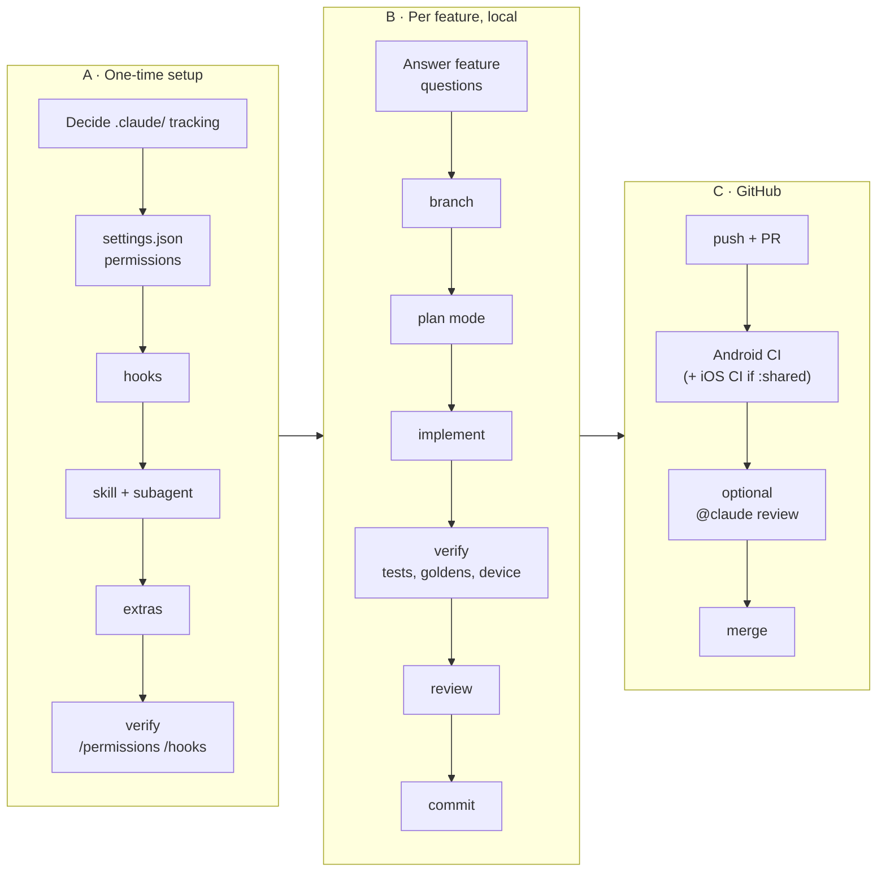

# Getting Started with the Claude Code Harness

**Status:** Part A done — A0–A5 (`.claude/` committed, permissions, three hooks, skills and
subagent, `CLAUDE.md` trimmed, extras); Part B done with the first feature, the result-count
header (PR #16). Part C is optional and not started.
Start here. Concepts and example config live in
[claude-code-harness.md](claude-code-harness.md); the first feature to build with it is in
[harness-test-feature.md](harness-test-feature.md).
Rendered copy with the flowchart drawn (for viewers without Mermaid, e.g. Android Studio):
[Claude Doc](https://claude.ai/code/artifact/bfb9bed4-e44c-4fb4-899e-eb62b1355c06).

The work splits into three parts: **set up the harness once**, **answer the feature questions**
before each feature, then **run the per-feature pipeline** from branch to merged PR.



## Where you type what

Every command below is marked with where it goes.

| Where | Prompt looks like | Used for |
| --- | --- | --- |
| **Terminal** (zsh, Android Studio's Terminal tab) | `$` | `git`, `claude`, `gh`, `chmod` |
| **Claude Code** (after running `claude`) | `>` | Prompts in plain English, `/commands`, `!cmd` to run a shell command inside the session |
| **Android Studio** | — | Emulator, Markdown preview of these docs, reviewing diffs |
| **GitHub** | — | PRs, CI checks, `@claude` comments (if part C is set up) |

Useful keys inside Claude Code: **Shift+Tab** cycles permission modes (default → accept edits →
plan), **Esc** interrupts, **Esc Esc** rewinds to an earlier message.

---

## A · One-time harness setup

Do the steps in order and verify each one before moving on: a broken hook is much easier to find
when it's the only new thing.

### A0. Decide whether `.claude/` is versioned

`.gitignore` currently ignores all of `/.claude`, including `CLAUDE.md`. Pick one:

| Option | `.gitignore` change | Good for | Cost |
| --- | --- | --- | --- |
| **Commit it** | Replace `/.claude` with `/.claude/settings.local.json` | Rules reviewable in PRs, survive a re-clone, usable by Claude in CI (part C needs this) | Personal preferences must move to `settings.local.json`; config is public on GitHub |
| **Keep it local** | None | Fast experimenting, nothing public | Lost on re-clone; CI and other machines never see it |

A reasonable path: keep it local while experimenting with A1–A4, then commit once the scorecard
in [harness-test-feature.md](harness-test-feature.md) passes.

**Decision (2026-10-02):** commit it. `.gitignore` now ignores only
`/.claude/settings.local.json`; personal overrides go there.

**Settings precedence** (highest wins): managed policy → command-line flags →
`.claude/settings.local.json` → `.claude/settings.json` → `~/.claude/settings.json`. Team rules go
in `settings.json`, personal ones in `settings.local.json`, cross-project ones in `~/.claude/`.

### A1. Permissions

**Terminal:**

```bash
git checkout ai_claude_code_harness
mkdir -p .claude/hooks .claude/agents .claude/skills/run-android
```

Create `.claude/settings.json` with the permissions block from
[claude-code-harness.md § 1](claude-code-harness.md#1-permissions), plus these gaps the original
block misses:

```json
"allow": [
  "Bash(./gradlew check:*)",
  "Bash(./gradlew recordPaparazziDebug:*)",
  "Bash(./gradlew verifyPaparazziDebug:*)",
  "Bash(./gradlew installDebug:*)",
  "Bash(adb devices:*)", "Bash(adb shell am start:*)", "Bash(adb exec-out screencap:*)"
],
"deny": [
  "Bash(./gradlew :app:connectedDebugAndroidTest:*)",
  "Bash(./gradlew :app:connectedAndroidTest:*)"
]
```

Merge these into the existing arrays; don't paste a second `allow` key.

**Verify in Claude Code:** start a fresh session (settings load at startup), type `/permissions`
and check both lists. Then type `run ./gradlew connectedDebugAndroidTest` — it must be refused.

### A2. Hooks

Create the scripts, then register them. Use `$CLAUDE_PROJECT_DIR` in paths so hooks work no matter
which directory the session is in.

`.claude/hooks/ktlint-on-edit.sh` — formats after Kotlin edits:

```bash
#!/usr/bin/env bash
file=$(jq -r '.tool_input.file_path // empty')
[[ "$file" == *.kt || "$file" == *.kts ]] || exit 0
cd "$CLAUDE_PROJECT_DIR" && ./gradlew ktlintFormat -q --console=plain >/dev/null 2>&1 || true
```

`.claude/hooks/block-coauthor.sh` — from
[claude-code-harness.md § 2](claude-code-harness.md#2-hooks); add the `#!/usr/bin/env bash` line
on top.

`.claude/hooks/compile-check.sh` — refuses "done" while Kotlin doesn't compile:

```bash
#!/usr/bin/env bash
input=$(cat)
[[ $(jq -r '.stop_hook_active // false' <<<"$input") == "true" ]] && exit 0
cd "$CLAUDE_PROJECT_DIR" || exit 0
git status --porcelain -uall | grep -qE '\.kts?$' || exit 0
if ! out=$(./gradlew compileDebugKotlin -q --console=plain 2>&1); then
  errors=$(grep -E '^e: ' <<<"$out" | head -n 20)
  echo "Compilation failed. Fix these errors before finishing:" >&2
  echo "${errors:-$(tail -n 20 <<<"$out")}" >&2
  exit 2
fi
exit 0
```

It skips when the working tree has no uncommitted `.kt`/`.kts` files, and lets Claude stop on
the second attempt (`stop_hook_active`). Exit 2 only feeds the errors back; it can't force a fix.

**Terminal:**

```bash
chmod +x .claude/hooks/*.sh
```

Register all three in `.claude/settings.json`:

```json
"hooks": {
  "PostToolUse": [
    { "matcher": "Edit|Write",
      "hooks": [{ "type": "command", "command": "\"$CLAUDE_PROJECT_DIR\"/.claude/hooks/ktlint-on-edit.sh" }] }
  ],
  "PreToolUse": [
    { "matcher": "Bash",
      "hooks": [{ "type": "command", "command": "\"$CLAUDE_PROJECT_DIR\"/.claude/hooks/block-coauthor.sh" }] }
  ],
  "Stop": [
    { "hooks": [{ "type": "command", "command": "\"$CLAUDE_PROJECT_DIR\"/.claude/hooks/compile-check.sh", "timeout": 300 }] }
  ]
}
```

**Verify:** new session → `/hooks` lists all three. You can also test a script without Claude:

```bash
echo '{"tool_input":{"command":"git commit -m \"x\n\nCo-Authored-By: a\""}}' \
  | .claude/hooks/block-coauthor.sh; echo "exit=$?"     # expect exit=2
```

### A3. Skill and subagent

- `.claude/skills/run-android/SKILL.md` — frontmatter with `name: run-android` and a
  `description:` saying when to use it ("launch the app on an emulator and screenshot it"), then
  the four steps from [claude-code-harness.md § 4](claude-code-harness.md#4-skill). Package name:
  `pl.gi.codingchallenge`.
- `.claude/agents/compose-reviewer.md` — the file from
  [claude-code-harness.md § 3](claude-code-harness.md#3-subagent).

**Verify:** asking Claude Code *"Which subagent types can you use?"* lists `compose-reviewer`;
typing `/` shows `run-android`.

### A4. Trim `CLAUDE.md`

Rules now enforced by config (no Co-Authored-By, no instrumented tests) shrink to one line each
that says *why*. Keep judgment rules (commit tags, clarifying questions, to-do lists) as they are.

### A5. Extras that improve the experience

Optional; add any time after A4. Grouped by what they help with.

**Done here:** all of these except unit tests in the Stop hook, deferred until compile-only
proves too weak (a cheaper variant is in [hook-upgrades.md](hook-upgrades.md)).

**Workflow**

| Extra | How to add | Why |
| --- | --- | --- |
| Status line | Claude Code: `/statusline show branch, model and context usage` | See branch and context % without asking; helps with the 80 % `/compact` rule |
| Desktop notification | `Notification` hook running `osascript -e 'display notification "Claude needs input" with title "Claude Code"'` | Switch to Android Studio while Claude works; get pinged when it waits for approval |
| `/new-feature` skill | `.claude/skills/new-feature/SKILL.md` (`disable-model-invocation: true`) holding the prompt from B3 with `$ARGUMENTS` for the feature name | Every feature starts with the same plan-first prompt and question checklist |
| Fewer prompts | Claude Code: `/fewer-permission-prompts` after a week of use | Scans past sessions and proposes allow rules for read-only commands you keep approving |

**IDE and quality**

| Extra | How to add | Why |
| --- | --- | --- |
| IDE link | Install the Claude Code plugin in Android Studio; in Claude Code type `/ide` | Diffs open in the IDE; Claude reads the IDE's diagnostics (`getDiagnostics`) |
| Unit tests in Stop hook | Extend `compile-check.sh` with `testDebugUnitTest` | Stronger "done" gate; costs ~30 s per turn, so add only if compile-only proves too weak |
| Pre-PR review | Claude Code: `/code-review` then `/simplify` on the branch | Catches bugs and cleanups before CI or a human sees them |

**Integrations**

| Extra | How to add | Why |
| --- | --- | --- |
| Backlog at start | `SessionStart` hook: `sed -n '/^## Open/,/^## Resolved/p' "$CLAUDE_PROJECT_DIR/docs/backlog.md"` | Stdout of SessionStart lands in context, so open tickets are known without asking |
| GitHub | `gh` is already installed and authenticated; allow `Bash(gh pr view:*)`, `Bash(gh run list:*)` | Claude opens PRs and reads CI results itself; a GitHub MCP server is only needed beyond what `gh` does |
| Parallel work | Terminal: `git worktree add ../CodingChallenge-x -b feat_x`, then `claude` inside it | Two features in two sessions without branch switching; each worktree needs its own Gradle build |

### A6. Gap check: is everything there?

The concept doc covers the *what*. These are the gaps it leaves, all handled above:

| Gap | Where it's handled |
| --- | --- |
| `.claude/` is gitignored, so nothing would be versioned | A0 |
| Deny rules miss `:app:`-prefixed task names | A1 |
| Paparazzi tasks not allowed, but UI changes need `recordPaparazziDebug` | A1, B5 |
| Hook scripts need `chmod +x`, a shebang, and `$CLAUDE_PROJECT_DIR` paths | A2 |
| Stop hook can loop forever without the `stop_hook_active` guard | A2 |
| `jq` is required by every hook (present at `/usr/bin/jq` on this Mac) | A2 |
| `ktlintFormat` via Gradle runs the whole project on each edit (seconds, not instant) | Accept it, or `brew install ktlint` and run `ktlint -F "$file"` in the hook |
| Co-Authored-By hook only sees text in the command; `git commit -F somefile` bypasses it | Low risk; Claude normally passes messages inline |
| Settings load at session start | Restart the session after every settings change |

---

## B · Per-feature pipeline

### B0. Questions to answer yourself first

Claude asks clarifying questions too, but answering these first makes the plan short and right.
Answers for the [test feature](harness-test-feature.md) are filled in as an example.

| # | Question | Why it matters | Test feature answer |
| --- | --- | --- | --- |
| 1 | What exactly does the user see, in which states? | Defines done | Header above results, `Success` state only |
| 2 | What are the edge cases? | Hidden scope | `Empty` is its own state, so `Success` always has ≥ 1 item |
| 3 | Which number or data, from where? | Wrong source = wrong feature | **Decide:** items shown in the list, or GitHub's `total_count`? Shown items needs no `:shared` change |
| 4 | Which module does it touch: `:app` only, or `:shared`? | `:shared` means iOS too, `[KMP]` tag, iOS CI runs | `:app` only |
| 5 | Which files and existing patterns? | Fits the codebase | `SuggestionPanel.kt`; `formatStars` style; `dimRes` + `dimens.xml`; test tags in `AutocompleteTestTags.kt` |
| 6 | Strings and localization? | Plurals need `<plurals>`, not `<string>` | New `<plurals>` in `strings.xml` (first one in the repo) |
| 7 | Accessibility? | Screen readers | Plain `Text`, read in order; no extra semantics needed |
| 8 | Which tests prove it? | Defines verification | Unit test for `formatResultCount`; Paparazzi `success` golden re-recorded |
| 9 | Does it change existing screenshots? | `check` runs `verifyPaparazziDebug`; CI fails on any pixel change | Yes: `..._success.png` changes |
| 10 | Commit tag and branch name? | Repo conventions | `[FEAT]`; branch `feat_result_count_header` |
| 11 | Out of scope? | Stops creep | No ViewModel, no `:shared`, no animation |

Answer 3 is the one real decision; the rest you can confirm by reading the code.

These are the answers planned up front. The shipped header went further ("50+" at the cap, a
heading plus live region, more tests); see
[the outcome](harness-test-feature.md#outcome).

### B1. Branch

**Terminal:**

```bash
git checkout develop && git pull
git checkout -b feat_result_count_header
```

### B2. Open the session

**Terminal** (repo root, in Android Studio's Terminal tab):

```bash
claude
```

**Claude Code:** `/ide` to link Android Studio (once per session, if the plugin is installed).
Glance at the status line or `/context` before big tasks.

### B3. Plan

Press **Shift+Tab** until the mode shows **plan**. Then:

```text
Implement the result-count header from docs/ai/harness-test-feature.md.
Decisions: count = items shown in the list (not total_count); :app only;
branch feat_result_count_header. Plan first.
```

Answer Claude's questions (`AskUserQuestion` menus). Approve the plan only when the to-do list
names the files, the plurals resource, the unit test and the Paparazzi re-record.

Or run `/new-feature <feature>` instead of typing the prompt. It also lists the existing tests the
change could break, and asks only what the code doesn't answer.

### B4. Implement

Approve the plan (this leaves plan mode). Watch for: ktlint hook after each `.kt` edit, unit tests
running without a prompt, Stop hook compile at the end. If something looks wrong, **Esc** and say
so; don't let it run on.

### B5. Verify

**Claude Code:**

```text
Run unit tests, re-record the Paparazzi goldens, then run ./gradlew check.
```

Open the changed `app/src/test/snapshots/images/..._success.png` in Android Studio and look at it:
a re-recorded golden is only right if the picture is right.

```text
/run-android
```

Search for "kotlin" on the emulator screenshot and confirm the header.

### B6. Review

**Claude Code:**

```text
Use the compose-reviewer agent on the changed composables.
```

```text
/code-review
```

```text
/simplify
```

Fix what's worth fixing; ask for anything unclear to be explained before accepting it.

### B7. Commit

**Claude Code:** `Commit this.` — expect a confirmation question, a `[FEAT]` subject, a bullet
body, no trailer.

### B8. Push and PR

**Claude Code:**

```text
Push the branch and open a PR to develop with a short summary and test notes.
```

(Or **Terminal:** `git push -u origin feat_result_count_header && gh pr create --base develop`.)

### B9. CI and merge

- **Android CI** (`android-ci.yml`) runs on the PR: `ktlintCheck`, then `check` (unit tests, lint,
  Paparazzi verify).
- **iOS CI** (`ios-ci.yml`) runs only when `shared/src/...` paths change; this feature won't
  trigger it.
- Failing? **Claude Code:** `CI failed on the PR, read the run with gh and fix it.`
- Green → merge on GitHub → **Terminal:** `git checkout develop && git pull`.
- If a backlog ticket was involved, mark it Resolved in `docs/backlog.md`.

---

## C · Optional: Claude in GitHub Actions

Runs Claude on GitHub, in addition to the local flow. Needs `.claude/` and `CLAUDE.md` committed
(A0), otherwise CI Claude ignores all repo rules.

1. **Claude Code:** `/install-github-app` — guides you through installing the Claude GitHub app,
   adding the auth secret to the repo, and opening a PR with a `.github/workflows/claude.yml`.
2. Review and merge that PR like any other CI change (`[AI]` tag).
3. **GitHub:** in a PR or issue comment, write `@claude review this for Compose issues` or
   `@claude fix the ktlint failure`. Claude replies or pushes commits to the branch.
4. Optional automatic review: add a `pull_request` trigger with a review prompt to the workflow.

Things to know first:

- Each run uses API credits (or your subscription token, depending on the auth chosen).
- Hooks run on the Linux runner, so the scripts must not rely on macOS (`osascript`) there.
- Treat Claude's pushed commits like any contributor's: CI must pass, you approve the merge.
