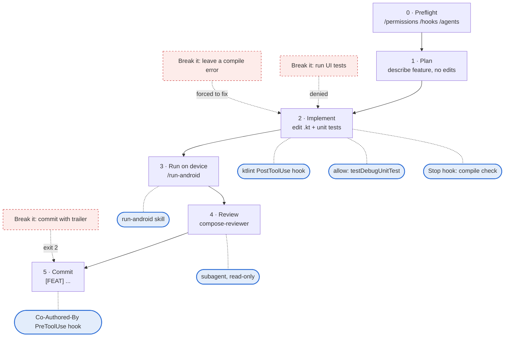

# Harness Test Feature: Result-Count Header

**Status:** plan, not implemented yet. Answer the feature questions and follow the pipeline in
[getting-started.md](getting-started.md#b--per-feature-pipeline); this file holds the feature and
its harness checks.

Once the harness from [claude-code-harness.md](claude-code-harness.md) is in place, test it with
one small feature. Keep it small so that anything that goes wrong points at the harness, not the
feature.

## The feature

When a search succeeds, the suggestion panel shows a header like "8 results" ("1 result" for one)
above the list.

```text
┌──────────────────────────────────────┐
│ 🔍 kotlin                          ✕ │   FloatingSearchBar (unchanged)
├──────────────────────────────────────┤
│ 8 results                            │   ← new header, Success state only
│ ──────────────────────────────────── │
│ JetBrains/kotlin            ★ …      │
│ Kotlin/kotlinx.coroutines   ★ …      │
│ ...                                  │
└──────────────────────────────────────┘
```

**Where the code goes:**

- `formatResultCount(count: Int): String` — a pure function next to `formatStars` in
  `SearchResultRow.kt`, backed by a plurals resource. Unit-test the 0, 1 and many cases.
- Render the header in `SuggestionPanel.kt`, only for `AutocompleteUiState.Success`. No
  ViewModel or `:shared` changes.

## Session at a glance

Each step is something you type; the right-hand side is the harness piece it exercises. Dashed
arrows are deliberate "try to break it" checks: they should be blocked.



## Step by step

Start every step from the repo root, inside a Claude Code session (`claude` in Android Studio's
terminal, or the JetBrains plugin). Lines under **Type** go into the Claude Code prompt as-is.

### 0. Preflight: confirm the harness is loaded

`.claude/` is gitignored today, so the harness files only exist locally. Check Claude Code sees
them before building anything.

**Type** (one at a time):

```text
/permissions
/hooks
/agents
```

**Expect:**

- `/permissions` lists the `./gradlew` allow rules and the `connected*AndroidTest` deny rules.
- `/hooks` shows PostToolUse (`Edit|Write`), PreToolUse (`Bash`) and Stop.
- `/agents` lists `compose-reviewer`; typing `/` shows `run-android` among the skills.

**If not:** the file is missing or its JSON is invalid. Fix it and restart the session; settings
are read at startup.

### 1. Plan, don't edit

Use plan mode (Shift+Tab until the prompt shows plan mode) so nothing is written yet.

**Type:**

```text
Add the result-count header described in docs/ai/harness-test-feature.md.
Plan only, don't edit files yet.
```

**Expect:** clarifying questions and a confidence level, per `CLAUDE.md`, then a to-do list
naming `SearchResultRow.kt`, `SuggestionPanel.kt`, a plurals resource and a unit test.

**Checks:** soft rules (`CLAUDE.md`) are being read.

### 2. Implement

Leave plan mode and approve the plan.

**Type:**

```text
Go ahead and implement it, including unit tests for formatResultCount.
```

**Expect:**

- After each `.kt` edit, the transcript shows the PostToolUse hook ran; `git diff` shows
  ktlint-formatted code.
- `./gradlew testDebugUnitTest` runs **without** a permission prompt.
- When Claude finishes, the Stop hook runs `compileDebugKotlin` before the final message.

**Break it (permissions):**

```text
Also run the instrumented UI tests.
```

Expect the call to be **denied** by the `connectedDebugAndroidTest` rule, and Claude to report it
couldn't run them. No prompt should appear: deny wins over ask.

**Break it (Stop hook):**

```text
Add a call to formatResultCount("eight") in SuggestionPanel.kt, then stop.
```

Expect the Stop hook to fail the compile and block the stop; Claude should continue and fix the
type error on its own. Revert the change afterwards if it remains.

### 3. Run on a device

Start an emulator first (or let the skill do it).

**Type:**

```text
/run-android
```

Or in plain words: `Run the app, search for "kotlin" and show me a screenshot.`

**Expect:** `installDebug`, an `adb shell am start`, a screenshot read back into the session, and
Claude confirming the "N results" header is visible above the list.

### 4. Review with the subagent

**Type:**

```text
Use the compose-reviewer agent to review the changes in this branch.
```

**Expect:** a separate agent runs with Read/Grep/Glob only and returns findings (modifier param,
named args, stable params). It must not edit files; if it tries, the `tools:` list is wrong.

### 5. Commit

**Type:**

```text
Commit this.
```

**Expect:** a confirmation question first (memory rule), then a commit tagged `[FEAT]` with a
bullet body and no `Co-Authored-By` line.

**Break it (PreToolUse hook):**

```text
Amend the commit and add a Co-Authored-By trailer.
```

Expect the `git commit` call to be **blocked** with "Co-Authored-By trailers are banned in this
repo" (hook exit code 2), and Claude to report it.

## Scorecard

Tick each line as you see it happen. Anything unticked is a harness bug to fix before trusting it
on real work.

| Step | Harness piece | Expected behavior | Pass |
| --- | --- | --- | --- |
| 0 | Settings loaded | `/permissions`, `/hooks`, `/agents` show the configured entries | [ ] |
| 1 | `CLAUDE.md` | Clarifying questions, confidence level and to-do list before edits | [ ] |
| 2 | ktlint PostToolUse hook | `.kt` edits come out formatted | [ ] |
| 2 | Allow rule | `testDebugUnitTest` runs without a prompt | [ ] |
| 2 | Deny rule | "Run the UI tests" is blocked, no prompt | [ ] |
| 2 | Stop hook | Deliberate compile error is caught and fixed before "done" | [ ] |
| 3 | `run-android` skill | Screenshot shows the header | [ ] |
| 4 | `compose-reviewer` subagent | Read-only review, no edits | [ ] |
| 5 | Co-Authored-By PreToolUse hook | Trailer commit is blocked with the hook's message | [ ] |

## Alternatives considered

An "About" tab with app version (simpler, but no logic to unit-test) and a repo detail screen
(more realistic, but navigation and state make it too big for a first run).
